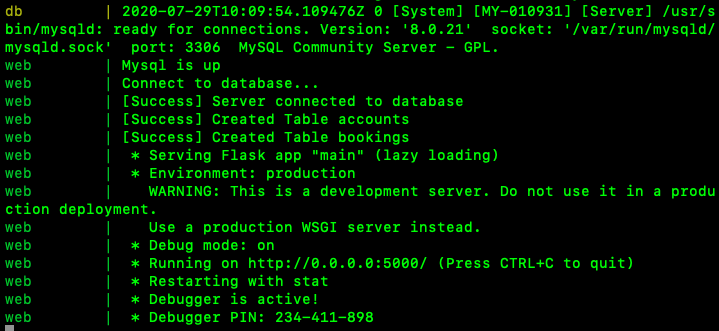

# Meeting Rooms Booking System
## How to run
1. Install docker
2. Clone repository
3. Get into directory
```
cd meeting-room-booking-system
```
4. Build up the system  
It'll cost almost 2.5 mins at the first time.
```
docker-compose --build
```
. 
5. Ready for usage

6. Look up api.json to communicate with the system